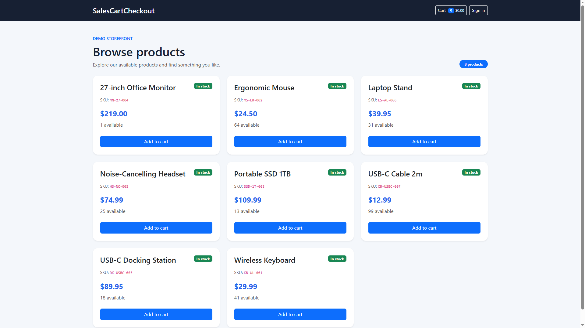
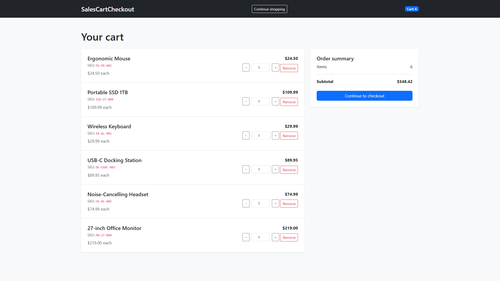
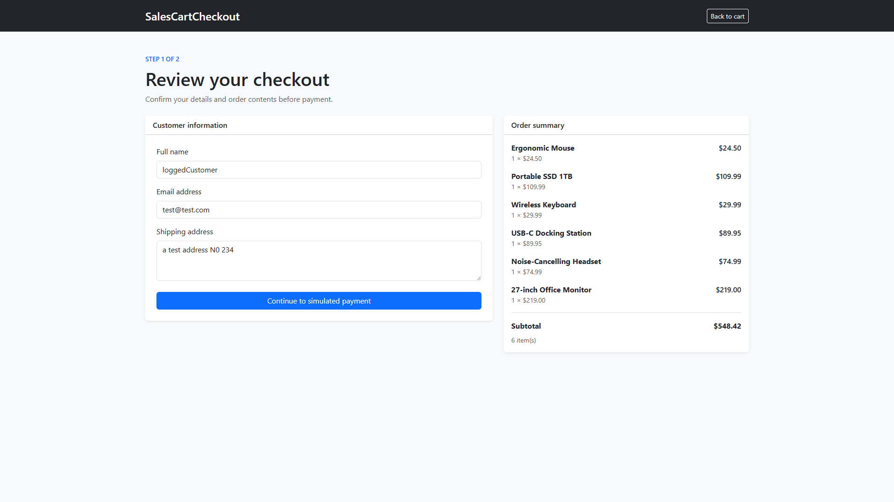
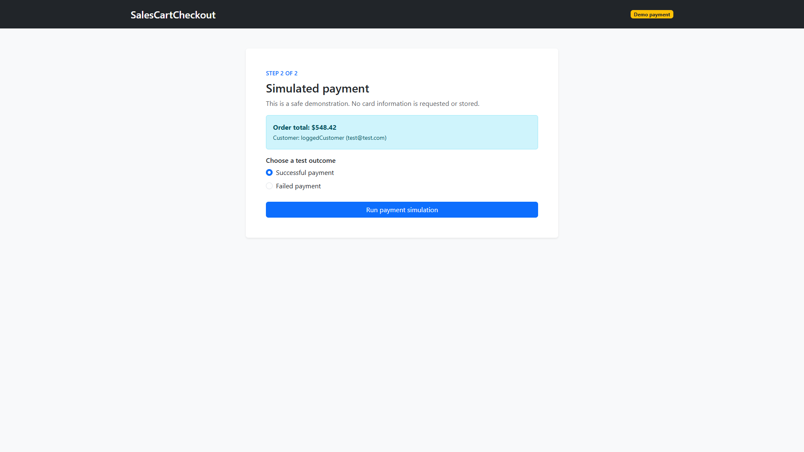
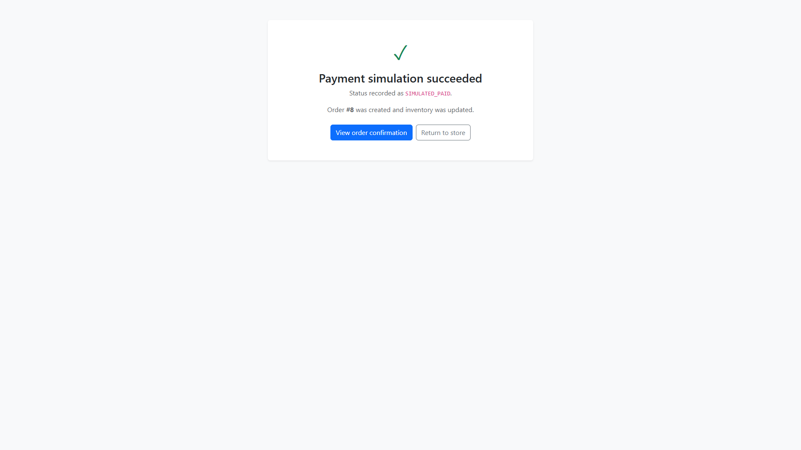
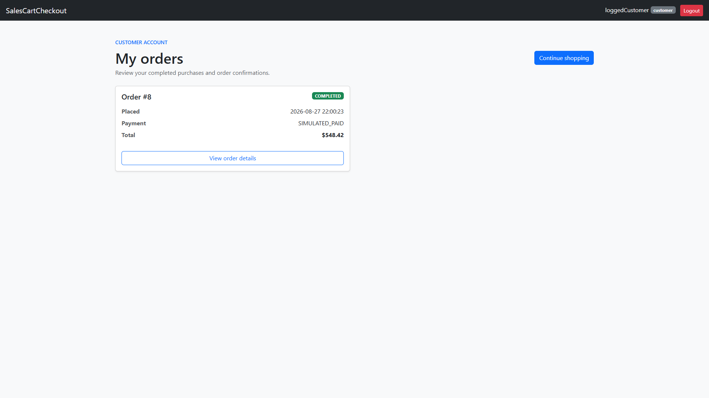
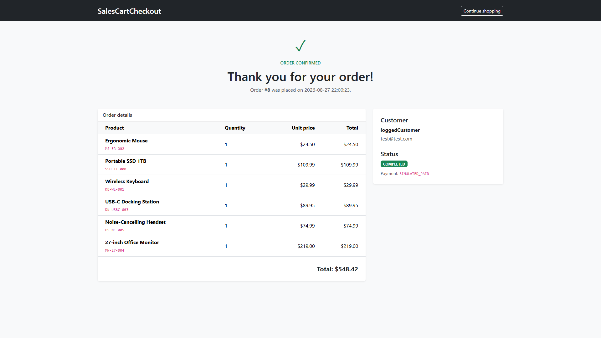
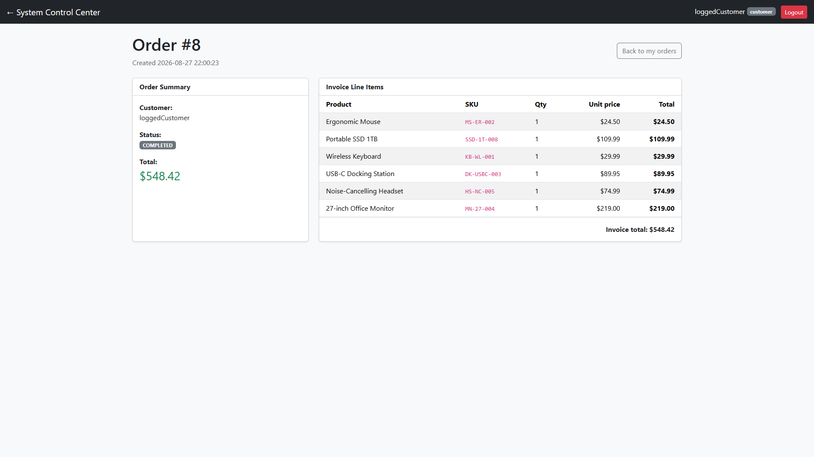
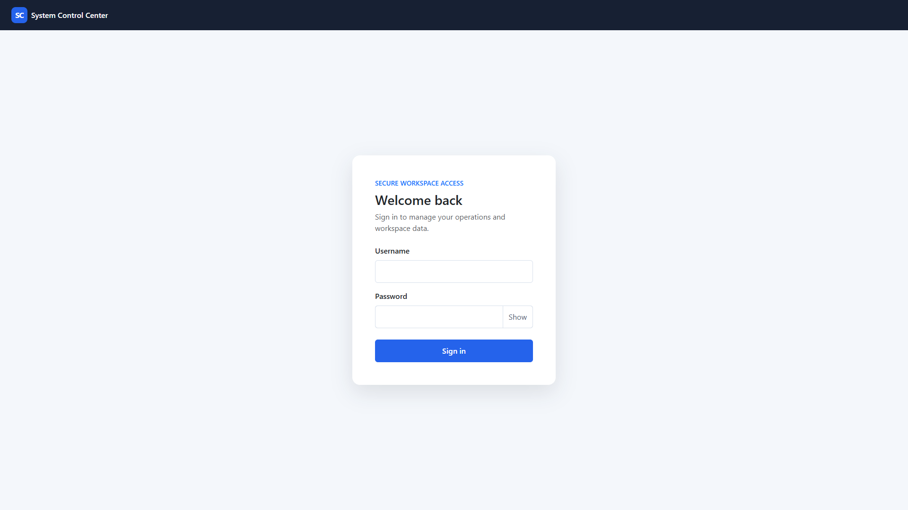
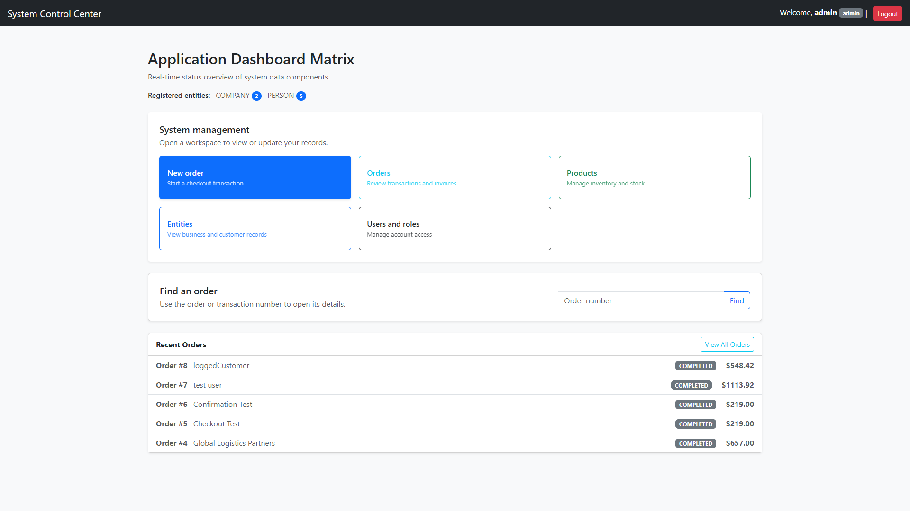

# SalesCartCheckout

SalesCartCheckout is a customer-centered shopping cart and checkout proof of concept built in C++17. It demonstrates a complete purchase flow, from browsing a public storefront through simulated payment, atomic inventory updates, order confirmation, and role-based back-office workflows.

The project is designed to show how a lightweight C++ web application can combine transactional data, session state, server-side validation, and a responsive user interface.

## Proof of concept

The application supports two connected experiences:

### Customer experience

- Browse products without signing in
- Add, remove, and adjust cart quantities
- Continue checkout as a guest
- Review customer and shipping information
- Complete a simulated successful or failed payment
- Receive an order confirmation with a transaction number
- Sign in as a customer to view personal order history

### Internal operations

- View and search orders by transaction number
- Open order details
- Restock inventory as a manager
- Issue full refunds as a manager or administrator
- Manage users and roles as an administrator
- Review products and business entities with viewer access

Guest purchases are persisted in SQLite. Customers can use the order number from their receipt, while managers and administrators can locate the transaction through the internal order search.

## Technology stack

- **C++17** — application logic, HTTP routing, validation, and transaction orchestration
- **cpp-httplib** — embedded HTTP server and request handling
- **Inja** — server-side HTML templating
- **nlohmann/json** — template data and structured application values
- **SQLite** — local relational database and transactional persistence
- **Liteqry** — small project data-access wrapper around SQLite
- **bcrypt** — password hashing and verification
- **Bootstrap** — responsive interface styling
- **Code::Blocks + MinGW GCC** — local build environment

All required third-party source dependencies are kept in `third_party/`. Only libraries used by the application are included.

## Architecture highlights

- Public storefront routes are separated from authenticated internal routes.
- Guest carts use an HTTP-only cart cookie and in-memory server-side cart state.
- Customer sessions use an HTTP-only session cookie backed by SQLite session records.
- `SessionStore` handles authenticated sessions and expiry.
- `CartStore` handles cart quantities, CSRF tokens, and the latest confirmation reference.
- Checkout revalidates product existence, prices, and stock on the server.
- Successful checkout creates the entity, order, line items, payment record, and stock changes inside one SQLite transaction.
- Customer order history is filtered by the authenticated user ID.
- Manager and administrator actions are protected by role checks and CSRF validation.

## Security decisions demonstrated

- Passwords are stored as bcrypt hashes, never plaintext.
- IDs, quantities, email values, prices, roles, and payment outcomes are validated server-side.
- Cart and authenticated state-changing requests require CSRF tokens.
- Customers cannot access internal management routes or another customer's order details.
- Payment is deliberately simulated; no card numbers, CVV values, or raw payment details are accepted or stored.
- Local databases and private configuration files are excluded from Git.

## Screenshots

### Storefront

### Cart and checkout

### Customer order history

### Internal workspace

## Running locally

The project is intended for Windows with Code::Blocks and the MinGW GCC toolchain.

1. Open `SalesCartCheckout.cbp` in Code::Blocks.
2. Build the Debug target.
3. Run `bin/Debug/SalesCartCheckout.exe`.
4. Open [http://localhost:8080/](http://localhost:8080/) or [the storefront](http://localhost:8080/store).

The root URL opens the storefront. Staff and customer accounts sign in at [http://localhost:8080/login](http://localhost:8080/login).

The executable reads `SalesCartCheckout.ini` beside the executable. It controls the host, port, database path, templates path, and static-file path.

### Database setup

The development database is local and ignored by Git. To initialize a new database, apply `data/seed.sql` with SQLite and update the `database` setting in the INI file if necessary.

User accounts are created by an administrator through **Dashboard → Users and roles**. Guest checkout does not require an account.

## Main routes

| Route | Purpose |
| --- | --- |
| `/` | Public storefront entry point |
| `/store` | Product storefront |
| `/cart` | Current guest or customer cart |
| `/checkout` | Checkout review |
| `/login` | Account sign-in |
| `/my-orders` | Signed-in customer order history |
| `/dashboard` | Internal workspace |
| `/orders-view` | Internal order list and transaction search |

## Project status

This repository is a functional local proof of concept. It is suitable for demonstrating application architecture, role-based access, transactional persistence, and customer checkout UX. It is not a production payment service.

Potential production extensions would include HTTPS, secure deployment configuration, persistent carts, email receipts, a hosted payment provider, automated integration tests, and customer profile address management.

## License

This project is licensed under the [MIT License](LICENSE).
